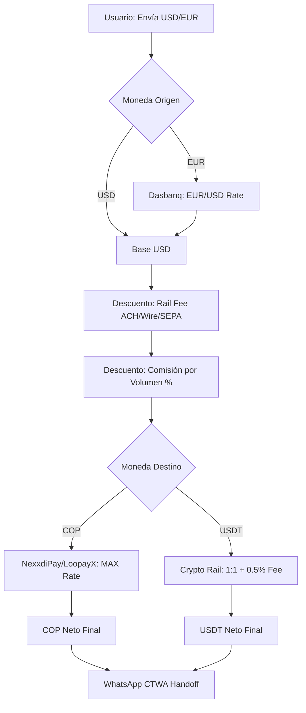

# 🧮 FBS Calculator: 42 Historias de Usuario
> **Motor de Cálculo:** Dasbanq (USD/EUR) + NexxdiPay/LoopayX (COP/USDT)

Este documento detalla la lógica de negocio y la experiencia de usuario (UX) del cotizador premium de FBS. El objetivo es abstraer la complejidad institucional tras una interfaz "mágica" donde el usuario solo ve lo que realmente importa: **cuánto envía y cuánto recibe.**

---

## 🏗️ Arquitectura del Motor (Visualización)

---

## 💎 Temas y Requerimientos

### 1. Experiencia de Usuario (UX) "Mágica"
| ID | Historia de Usuario | Detalle de Implementación |
|:---|:---|:---|
| **US01** | **Interfaz Minimalista** | El cotizador domina el hero sin tablas de tasas confusas. |
| **US02** | **Rolling Numbers** | Respuesta instantánea con animación de contador al escribir. |
| **US03** | **Cálculo Neto-Neto** | Todas las comisiones se restan *antes* del resultado final. |
| **US04** | **Modo de Swap** | Botón central para invertir flujo (Enviar ↔ Recibir). |
| **US05** | **Live Status** | Punto verde parpadeante indicando "Live Data". |
| **US06** | **Marca FBS** | Abstracción total de proveedores (Dasbanq/NexxdiPay ocultos). |
| **US07** | **Auto-Corrección** | Si el monto es inferior al mínimo del corredor ($100 para USD/USDT, otros TBD), se ajusta automáticamente al mínimo con un tooltip. |

> [!TIP]
> **Efecto "Wow":** El usuario nunca debe ver un estado de carga. El cálculo ocurre en tiempo real mientras el teclado está activo.

---

### 2. Selección de Divisas y Rieles Internacionales
| ID | Flujo | Requisito Visual / Lógico |
|:---|:---|:---|
| **US08** | **Input EUR** | Dropdown con bandera de la UE y label SEPA. |
| **US09** | **Input USD** | Selector claro entre WIRE y ACH. |
| **US10** | **Output COP** | Bandera de Colombia + Logos Bancolombia/Nequi. |
| **US11** | **Output USDT** | Logo de Tether (USDT) + Protocolos (TRC20/ERC20). |
| **US12** | **Logic Base** | Conversión EUR → USD usando spread de venta de Dasbanq. |
| **US13** | **Tactile UI** | Selectores con feedback háptico (look & feel iOS). |
| **US14** | **Hot-Swap** | Cambio de divisa sin recargar la página. |

---

### 2.1 Corredores Activos y Montos Mínimos
| ID | Historia de Usuario (Corredor) | Riel de Entrada | Riel de Salida | Monto Mínimo |
|:---|:---|:---|:---|:---|
| **US43** | **USDT → COP (Principal)** | USDT TRC20/ERC20 | COP — Bancolombia/Nequi/Daviplata | $100 USDT |
| **US44** | **EUR → COP** | EUR SEPA | COP — Bancolombia/Nequi | TBD |
| **US45** | **EUR → USDT** | EUR SEPA | USDT TRC20/ERC20 | TBD |
| **US46** | **USD → COP** | USD Wire/ACH | COP — Bancolombia/Nequi | $100 USD |
| **US47** | **USD → MXN** | USD ACH | MXN SPEI | $100 USD |
| **US48** | **MXN → USDT** | MXN SPEI | USDT TRC20/ERC20 | TBD |
| **US49** | **USDT → EUR** | USDT | EUR SEPA | TBD |
| **US50** | **COL → VES (Secundario)** | COP / USDT | VES / USDT | TBD |

---

### 3. Motor COP (NexxdiPay / LoopayX)
| ID | Lógica de Negocio | Regla Técnica |
|:---|:---|:---|
| **US15** | **Frecuencia Polling** | Fetch de tasas cada 5 segundos (SR-side). |
| **US16** | **Optimización de Tasa** | Fórmula: `Math.max(NexxdiPay, LoopayX)`. |
| **US17** | **Spread FBS** | Restar $[X] COP a la tasa MAX antes de mostrar. |
| **US18** | **Resiliencia/Fallback** | Si un provider cae (0), usar el otro automáticamente. |
| **US19** | **Tier 1 (1K-5K)** | Deducción: 0.2% + $2,000 COP fijos. |
| **US20** | **Tier 2 (>5K)** | Deducción: $2,400 COP fijos (ignora porcentaje). |
| **US21** | **Transparencia** | Tooltip: "Lo que ves es lo que llega". |

---

### 4. Motor Internacional (Dasbanq USD/EUR)
> [!IMPORTANT]
> **Límites de Mesa OTC:** Para montos superiores a $3,000 USD, el sistema debe bloquear el cálculo automático y habilitar la **Cotización VIP** vía WhatsApp para ofrecer spreads competitivos de ballena.

| ID | Regla de Volumen | Comisión Aplicada |
|:---|:---|:---|
| **US24** | Menos de $1,000 USD | 2.0% |
| **US25** | $1,000 a $3,000 USD | 1.5% |
| **US26** | **Más de $3,000 USD** | **VIP Quote (WhatsApp Only)** |

**Costos de Riel (Rail Fees):**
- **US27:** Salida vía USD Wire → -$25 USD del base.
- **US28:** Entrada vía EUR SEPA → -$2 USD del base.

---

### 5. Salida Crypto (USDT)
- **US29:** Ratio de paridad 1:1 con el USD base neto.
- **US30:** Comisión fija de procesamiento crypto: **0.5%**.
- **US31:** Ejemplo de flujo: `(1000 EUR * Rate) - $2 SEPA - 0.5% Fee = Neto USDT`.
- **US32:** UX Trust: Sin mención de exchanges volátiles; el USDT se trata como dólar digital.

---

### 6. Handoff CTWA (WhatsApp)
- **US33:** Captura de `state` completo de la calculadora al click.
- **US34:** **Mensaje Estructurado:** "Hola, quiero cotizar un envío de [Monto] [Divisa-Riel] para recibir [COP/USDT]. Cotización web: [Resultado]."
- **US35:** **Meta Pixel:** Disparo de evento `Contact` con valor en USD.
- **US36:** **GA4:** Evento `whatsapp_click` con parámetros de moneda.
- **US37:** **UTM Persistence:** Los tags de marketing se inyectan en el mensaje o se loguean para el bróker.

---

### 7. Resiliencia y Seguridad (Edge Cases)
- **US38:** **Intelligent Fallback:** Cache de 5 minutos si Dasbanq falla.
- **US39:** **Input Sanitization:** Bloqueo de caracteres no numéricos.
- **US40:** **LCP Optimization:** Caching server-side para no bloquear el renderizado inicial.
- **US41:** **Mobile UX:** Atributo `inputmode="decimal"` para teclado numérico.
- **US42:** **Anti-Scraping:** El polling ocurre en `/api/rates` (Next.js handles), protegiendo las API Keys originales.

---

> [!NOTE]
> **Documento de Referencia:** Este set de historias de usuario es el contrato de aceptación para el desarrollo del componente `QuoteCalculator.tsx`.
