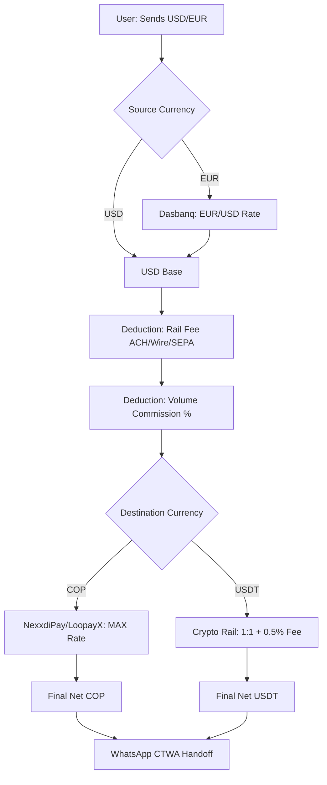

# 🧮 FBS Calculator: 42 User Stories
> **Calculation Engine:** Dasbanq (USD/EUR) + NexxdiPay/LoopayX (COP/USDT)

This document outlines the business logic and user experience (UX) for the FBS premium quote calculator. The goal is to abstract institutional complexity behind a "magical" interface where the user only sees what truly matters: **how much they send and how much they receive.**

---

## 🏗️ Engine Architecture (Visualization)

---

## 💎 Themes & Requirements

### 1. "Magical" User Experience (UX)
| ID | User Story | Implementation Detail |
|:---|:---|:---|
| **US01** | **Minimalist Interface** | The calculator dominates the hero without confusing rate tables. |
| **US02** | **Rolling Numbers** | Instant response with counter animation while typing. |
| **US03** | **Net-to-Net Calculation** | All commissions are deducted *before* the final result. |
| **US04** | **Swap Mode** | Center button to invert flow (Send ↔ Receive). |
| **US05** | **Live Status** | Pinging green dot indicating "Live Data". |
| **US06** | **FBS Branding** | Total abstraction of providers (Dasbanq/NexxdiPay hidden). |
| **US07** | **Auto-Correction** | If amount is below corridor minimum ($100 for USD/USDT, others TBD), auto-adjust to minimum with a tooltip. |

> [!TIP]
> **"Wow" Effect:** The user should never see a loading state. Calculation happens in real-time while the keyboard is active.

---

### 2. Currency Selection & International Rails
| ID | Flow | Visual / Logical Requirement |
|:---|:---|:---|
| **US08** | **EUR Input** | Dropdown with EU flag and SEPA label. |
| **US09** | **USD Input** | Clear selector between WIRE and ACH. |
| **US10** | **COP Output** | Colombia flag + Bancolombia/Nequi logos. |
| **US11** | **USDT Output** | Tether (USDT) logo + Protocols (TRC20/ERC20). |
| **US12** | **Logic Base** | EUR → USD conversion using Dasbanq sell spread. |
| **US13** | **Tactile UI** | Selectors with haptic feedback (iOS look & feel). |
| **US14** | **Hot-Swap** | Currency change without page refresh. |

---

### 2.1 Active Corridors & Minimums
| ID | User Story (Corridor) | Input Rail | Output Rail | Minimum Amount |
|:---|:---|:---|:---|:---|
| **US43** | **USDT → COP (Primary)** | USDT TRC20/ERC20 | COP — Bancolombia/Nequi/Daviplata | $100 USDT |
| **US44** | **EUR → COP** | EUR SEPA | COP — Bancolombia/Nequi | TBD |
| **US45** | **EUR → USDT** | EUR SEPA | USDT TRC20/ERC20 | TBD |
| **US46** | **USD → COP** | USD Wire/ACH | COP — Bancolombia/Nequi | $100 USD |
| **US47** | **USD → MXN** | USD ACH | MXN SPEI | $100 USD |
| **US48** | **MXN → USDT** | MXN SPEI | USDT TRC20/ERC20 | TBD |
| **US49** | **USDT → EUR** | USDT | EUR SEPA | TBD |
| **US50** | **COL → VES (Secondary)** | COP / USDT | VES / USDT | TBD |

---

### 3. COP Engine (NexxdiPay / LoopayX)
| ID | Business Logic | Technical Rule |
|:---|:---|:---|
| **US15** | **Polling Frequency** | Fetch rates every 5 seconds (SR-side). |
| **US16** | **Rate Optimization** | Formula: `Math.max(NexxdiPay, LoopayX)`. |
| **US17** | **FBS Spread** | Subtract $[X] COP from MAX rate before displaying. |
| **US18** | **Resilience/Fallback** | If one provider fails (0), use the other automatically. |
| **US19** | **Tier 1 (1K-5K)** | Deduction: 0.2% + $2,000 COP fixed. |
| **US20** | **Tier 2 (>5K)** | Deduction: $2,400 COP fixed (ignores percentage). |
| **US21** | **Transparency** | Tooltip: "What you see is what you get". |

---

### 4. International Engine (Dasbanq USD/EUR)
> [!IMPORTANT]
> **OTC Desk Limits:** For amounts exceeding $3,000 USD, the system must block the automatic calculation and enable **VIP Quoting** via WhatsApp to offer competitive whale spreads.

| ID | Volume Rule | Applied Commission |
|:---|:---|:---|
| **US24** | Less than $1,000 USD | 2.0% |
| **US25** | $1,000 to $3,000 USD | 1.5% |
| **US26** | **Over $3,000 USD** | **VIP Quote (WhatsApp Only)** |

**Rail Fees:**
- **US27:** Outbound via USD Wire → -$25 USD from base.
- **US28:** Inbound via EUR SEPA → -$2 USD from base.

---

### 5. Crypto Output (USDT)
- **US29:** 1:1 parity ratio with the net USD base.
- **US30:** Fixed crypto processing fee: **0.5%**.
- **US31:** Flow example: `(1000 EUR * Rate) - $2 SEPA - 0.5% Fee = Net USDT`.
- **US32:** UX Trust: No mention of volatile exchanges; USDT is treated as digital dollar.

---

### 6. CTWA Handoff (WhatsApp)
- **US33:** Capture full calculator `state` on click.
- **US34:** **Structured Message:** "Hi, I want to quote a transfer of [Amount] [Currency-Rail] to receive [COP/USDT]. Web quote: [Result]."
- **US35:** **Meta Pixel:** Fire `Contact` event with value in USD.
- **US36:** **GA4:** Fire `whatsapp_click` event with currency parameters.
- **US37:** **UTM Persistence:** Marketing tags are injected into the message or logged for the broker.

---

### 7. Resilience & Security (Edge Cases)
- **US38:** **Intelligent Fallback:** 5-minute cache if Dasbanq fails.
- **US39:** **Input Sanitization:** Block non-numeric characters.
- **US40:** **LCP Optimization:** Server-side caching to avoid blocking initial render.
- **US41:** **Mobile UX:** `inputmode="decimal"` attribute for numeric keypad.
- **US42:** **Anti-Scraping:** Polling happens at `/api/rates` (Next.js handles), protecting original API Keys.

---

> [!NOTE]
> **Reference Document:** This set of user stories is the acceptance contract for the `QuoteCalculator.tsx` component development.
